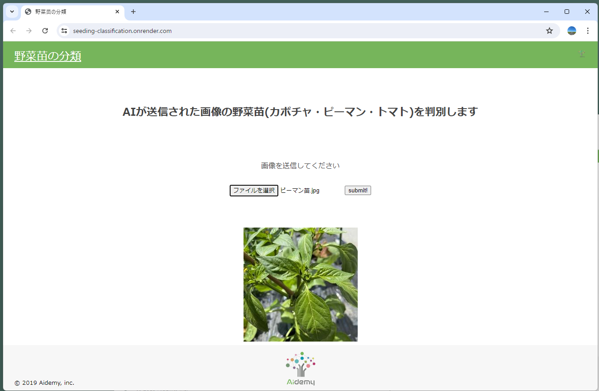

# Seedling Classification Using VGG16 Model
This project utilizes the VGG16 model to classify images of seedlings into three categories: pumpkin, green pepper, and tomato. By uploading an image and pressing the submit button, the model will provide the classification result.

## Getting Started

### Render Environment
Checked operating environment is as follows
- **Python 3.10.11**

To run this project on [Render](https://render.com/), install the required modules listed in `requirements.txt`.

`pip install -r requirements.txt`

### Application Development Environment
Checked operating environment is as follows
- **Windows 11 23H2**
- **Python 3.10.11**
- **tensorflow : 2.15.1**

To run this project locally, install the required modules listed in `requirements_local_240705.txt`.

#### Steps
1. Download the Python 3.10.11 installer:
    Download the installer for version 3.10.11 from the [official Python website](https://www.python.org/downloads/)

1. Create a virtual environment with Python 3.10:

    Use the following command to create a virtual environment with Python 3.10.
    ```
    py -3.10 -m venv .venv
    ```

1. Install the required modules:

    Use the following command to install the modules.
    ```
    pip install -r requirements_local_240705.txt
    ```

## images



